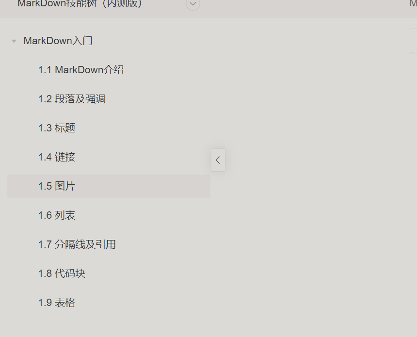

<!-- 工具 -->

# 目录

- [Windows](#windows)
- [Vscode](#vscode)
- [Git](#git)
- [Markdown](#markdown)

# Windows

## `Hosts`文件

- 位置：`C:\Windows\System32\drivers\etc`
- 作用：
  - （1）加快域名解析，通过在 `Hosts` 中配置域名和IP的映射关系，提高域名解析速度；
  - （2）屏蔽网站，用 `Hosts` 把禁止访问的网站的域名映射到一个错误的 `IP` 或本地计算机的 `IP`
  - （3）局域网服务器地址映射，给局域网服务器取个容易记住的名字，然后在 `Hosts` 中建立IP映射

## 档案整理

- 文件排序的方式：时间、类型、名称
- 文件分类的方式：
  - 按文件本身属性分类：IMG、GIF、DOC
  - 按文件内容主体分类：生活、工作、学习、兴趣
    - 生活（衣食住行，按照主题分类）
    - 工作-Works（项目）
    - 兴趣（绘画、锻炼、摄影）
    - 娱乐（片片、社会、国家、国际）
    - 学习（本职专业、拓展事业、学业提升、沟通交流）
    - 记录（2022-01-02，摄影图片-时间排序方式）
    - 收件箱-Inbox（孵化箱，所有未归档的临时文件）

## 字符、字节、GBK、UTF-8、位

数据存储是以“字节”（Byte）为单位，数据传输大多是以“位”（bit，又名“比特”）为单位，一个位就代表一个0或1（即二进制），每8个位（bit，简写为b）组成一个字节（Byte，简写为B），是最小一级的信息单位。在 GBK 编码中，一个汉字字符存储需要 2 个字节。在 UTF-8 编码中，一个英文字母字符存储需要 1 个字节，一个汉字字符储存需要 3 到 4 个字节。

# Vscode

## 快捷键

- 删除一行：`ctrl + shift + k`
- 缩进：左 `ctrl + [`,右 `ctrl + ]`

# Git

- 撤销上次`commit`: `git reset --soft HEAD^`

## 配置upstream

git remote -v
git remote add upstream git@gitlab.clouddeep.cn:lnfra/deepspa-admin.git
<!-- git branch --unset-upstream -->

git fetch upstream
git merge upstream/dev

## git config

git config --global user.name "kdsakpsol"
git config --global user.email "ahead_zhaoxinqing@163.com"
git config --global --list
<!-- user.name=zhaoxinqing -->
<!-- user.email=xinqing.zhao@clouddeep.cn -->

## rebase 和 merge 的区别

<https://blog.csdn.net/weixin_41231928/article/details/107040880>
2.回滚代码到某个commit
(1)Git log：获取历史提交信息；
(2)Git reset --hard commited_id（提交记录的唯一标识id）;

optimize: 优化
upgrade: 升级改造
chore: 小改动，一行两行的改动
style: 格式（不影响代码运行的变动）
perf: Performance的缩写，提升代码性能
refactor：重构（既不是新增功能，也不是修改bug的代码变动）
br: 此项特别针对bug号，用于向测试反馈bug列表的bug修改情况
feat：新功能（feature）
fix：修补
docs：文档（documentation）
test：增加测试
revert：feat(pencil): add 'graphiteWidth' option (撤销之前的commit)
bugfix：修补bug
test：新增测试用例或是更新现有测试

## Git 使用相关

git commit之后，撤销commit

git reset --soft HEAD^

- 这样就成功的撤销了你的commit
- 注意，仅仅是撤回commit操作，您写的代码仍然保留。
- HEAD^的意思是上一个版本，也可以写成HEAD~1
- 如果你进行了2次commit，想都撤回，可以使用HEAD~2

## 变基和合并

Git Merge 和 Git Rebase 目的相同，它们都是把不同分支的提交合并到一起。虽然最终目的是一致的，但是其过程却颇为不同。

rebase，合并的结果好看，一条线，但合并过程中出现冲突的话，比较麻烦

- rebase过程中，一个commit出现冲突，下一个commit也极有可能出现冲突，一次rebase可能要解决多次冲突；
- 合并的历史脉络（冲突）被物理消灭了
- merge，合并结果不好看，一堆线交错，但合并有冲突的话，只要解一次就行了；

 **推荐方案：**

- 尽量及时rebase上游分支，发现有冲突，及时merge；
- 在未提交到代码库的本地文件上使用rebase，这样还可以隐藏自己过多的分支细节；
- 随着团队增长，通过 merge 策略很难管理和追踪到每个提交。为了提交历史更清晰、更易于理解，使用 Rebase 是一个明智、高效的选择；

## 常见命令

- git fetch：可以git fetch [alias]取某一个远程repo,也可以git fetch --all取到全部repo；
- git checkout：切换分支；
- git branch：查看分支；
- git log：查看提交log信息；
- git status：查看仓库文件修改状态；

## Github库删除处理办法

故障描述：删除私人仓库误删项目总库，并且原始库不能直接恢复；

1、创建新仓库：

- 在原位置创建新仓库：<https://github.com/spatial-go/geoos>

2、本地代码推送到远程仓库：

- 将本地比较新的个人仓库推送到远程仓库：git push -u upstream main
- git checkout upstream/develop

3、推送标签到远程仓库：

- git push upstream --tags

4、github仓库中根据已有标签创建release；

5、github仓库添加钉钉机器人；

6、github仓库权限设置；

7、github仓库pull request规则设置；

## 统计代码提交行数

git log --since ==2022-05-10 --until=2022-07-22 | wc -l

# Markdown

## 1、强调
<!-- 使用星号 * 和下划线 - 作为标记强调字词的符号 -->
斜体：*`wo-cao!!!!!!`*

粗体：**`wocao!!!!`**

删除：~~`wocao!!!!!`~~

## 2、标题

```md
# 一级标题

## 二级标题

### 三级标题

#### 四级标题

##### 五级

###### 六级
```

## 3、链接
<!-- [Google](https://www.google.com/) -->
[Google](https://www.google.com/ "这是鼠标悬浮文案")

## 4、图片



## 5、列表
<!-- 无序列表使用 * 、 + 或是 - 作为列表标记 -->
无序

- 第一天
- 第二天
- 第三天

<!-- 有序列表则使用数字接着一个英文句号 -->
有序

1. 第一天
2. 第二天
3. 第三天
4. 第四天

<!--  - [ ] todo，其中 [ ] (带空格的中括号)表示未完成的任务，[x](带字母x的中括号) 表示已经完成的任务 -->
任务列表

- [ ] todo
- [x] todo 起床
- [x] 吃饭
- [ ] 工作
- [ ] 睡觉

## 6、分割线及引用
<!-- 三个或以上的*、-、_来创建一个分隔线 -->
---

<!-- 在要引用内容每行的最前面加上 > ，就可以在 Markdown 文档中创建一个区块引用 -->
> 程序员的三种美德
>
> 1. 懒惰
> 2. 急躁
> 3. 傲慢
>
>下面是代码的示例：
>
>> ```return shell_exec("echo $input | $markdown_script");```

## 7、代码块
<!-- 两个 ` 将代码内容包裹起来就是一个行内代码 -->
<!-- 1 个 tab 可以创建一个缩进代码块 -->
<!-- 三个反引号（ ``` ）把需要高亮显示的代码包裹起来，并在第一个 ``` 的末尾标识上语言类型就可以创建一个高亮代码块 -->

```go

type Info struct {
    Name   string `json:"name"`
    Age    int8   `json:"age"`
    Gender int8   `json:"gender"`
}

func main() {
    var info Info
    fmt.Sprintln(info)
}

```

## 8、表格
<!-- 第一行包含表头，并用"竖线"（ | ）分隔
第二行将标题与单元格分开，并且必须包含三个或更多破折号
第三行以及随后的任何行均包含单元格值 -->
<!-- :--: 两端都有冒号表示内容和标题栏居中对齐
:--- 左侧冒号表示内容和标题栏居左对齐
---: 右侧冒号表示内容和标题栏居右对齐 -->

|序号|姓名|年龄|性别|
|:--:|:---|:---|---:|
|1|王二|20|1|
|2|张大大|25|0|
|3|赵五|25|1|
